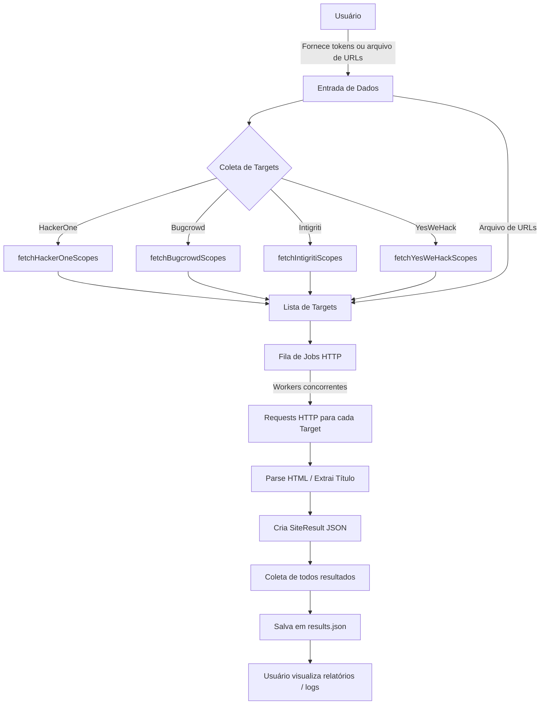

## **Data Flow – Bug Bounty Site Checker**



---

## **README.md**

````markdown
# Bug Bounty Site Checker

Ferramenta para coleta de escopos de programas de Bug Bounty via APIs e verificação de disponibilidade HTTP dos sites.

## Funcionalidades

- Coleta automática de escopos/sites das seguintes plataformas:
  - HackerOne
  - Bugcrowd
  - Intigriti
  - YesWeHack
- Suporte a **API Keys** / tokens para acesso autenticado.
- Leitura de **URLs de arquivos locais**.
- Requests HTTP concorrentes com controle de timeout e delay.
- Extração de título (`<title>`) do HTML.
- Geração de **JSON com resultados detalhados**:
  - URL resolvida
  - HTTP status
  - Título
  - Tamanho do conteúdo
  - Tempo de execução da requisição

## Requisitos

- Go 1.20+
- Tokens de API (opcional, mas necessário para programas privados)

## Uso

```bash
# Build
go build -o bugsites main.go

# Executar com tokens/API
./bugsites \
  -h1-user "usuario" -h1-key "apikey_h1" \
  -bc-token "token_bc" \
  -int-token "token_int" \
  -ywh-token "token_ywh" \
  -file targets.txt \
  -concurrency 10 \
  -timeout 15 \
  -delay 200 \
  -out results.json
````

### Flags

| Flag           | Descrição                      |
| -------------- | ------------------------------ |
| `-h1-user`     | Username HackerOne para API    |
| `-h1-key`      | API key HackerOne              |
| `-bc-token`    | Token Bugcrowd                 |
| `-int-token`   | Token Intigriti                |
| `-ywh-token`   | Token YesWeHack                |
| `-file`        | Arquivo com URLs/targets       |
| `-concurrency` | Número de workers concorrentes |
| `-timeout`     | Timeout de request em segundos |
| `-delay`       | Delay entre requests (ms)      |
| `-path`        | Path a anexar a cada host      |
| `-out`         | Arquivo de saída JSON          |

## Estrutura de saída

```json
[
  {
    "input": "hackerone.com",
    "resolved_url": "https://hackerone.com/",
    "http_status": 200,
    "title": "HackerOne: The #1 Bug Bounty Platform",
    "content_length": 54625,
    "checked_at": "2025-09-30T23:44:04Z",
    "elapsed_ms": 350
  }
]
```

## Fluxo de dados

1. Usuário fornece tokens de API ou arquivo de URLs.
2. Ferramenta consulta APIs das plataformas para coletar escopos autorizados.
3. Todas as URLs coletadas são inseridas em uma fila de jobs HTTP.
4. Workers concorrentes executam requisições para cada target.
5. HTML de cada página é analisado para extrair `<title>` e tamanho de conteúdo.
6. Resultados são consolidados e salvos em JSON.

## Observações

* Apenas URLs autorizadas devem ser testadas.
* Para programas privados, tokens válidos são obrigatórios.
* É recomendável ajustar `concurrency` e `delay` para evitar bloqueio por rate-limiting.

