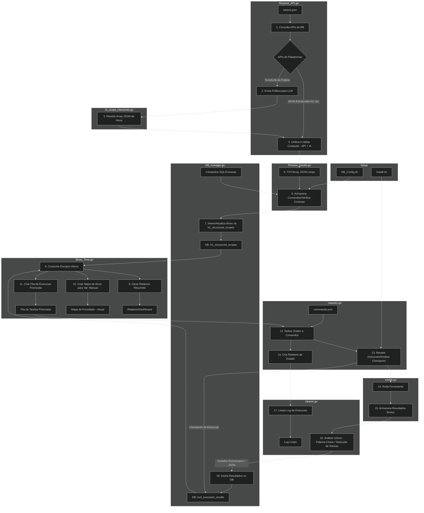

# AutoHunting - README



## Descrição
O `install.sh` é um script Bash projetado para automatizar a instalação de ferramentas de segurança cibernética e reconciliação (recon) em sistemas Linux baseados em Arch (usando `pacman`), Debian (apt), Fedora (dnf/yum) ou outros sistemas compatíveis. Ele suporta instalações via gerenciadores de pacotes do sistema, Go, Python (pip), e clonagem de repositórios Git. O script é interativo, permitindo ao usuário selecionar categorias de ferramentas ou instalar todas de uma vez, com suporte a instalações paralelas para maior eficiência.

## Funcionalidades
- **Gerenciamento de Pacotes**: Detecta automaticamente o gerenciador de pacotes (`pacman`, `apt`, `dnf`, ou `yum`) e instala ferramentas compatíveis.
- **Métodos de Instalação**:
  - **Gerenciador de Pacotes**: Usa o gerenciador do sistema para instalar ferramentas disponíveis (e.g., `curl`, `nmap`).
  - **Go**: Instala ferramentas Go-based com `go install` (e.g., `subfinder`, `nuclei`).
  - **Pip**: Instala ferramentas Python-based com `pip3` (e.g., `wafw00f`, `linkfinder`).
  - **Git**: Clona repositórios Git para ferramentas sem pacotes pré-compilados (e.g., `katana`, `reconftw`).
- **Categorias de Ferramentas**:
  - **Base**: Ferramentas essenciais (`curl`, `jq`, `git`, `nmap`, `go`, `python`).
  - **Recon**: Ferramentas de reconciliação (`subfinder`, `amass`, `katana`, etc.).
  - **Scanners**: Ferramentas de varredura (`nuclei`, `ffuf`, `nikto`, etc.).
  - **Web**: Ferramentas para análise web (`gopherus`, `lfisuite`, etc.).
  - **Aux**: Ferramentas auxiliares (`kiterunner`, `eyewitness`, etc.).
  - **Misc**: Ferramentas diversas (`linkfinder`, `metasploit`, etc.).
- **Paralelismo**: Instala até 4 pacotes simultaneamente (`MAX_JOBS=4`) para maior rapidez.
- **Modo Simulação**: Suporta execução em modo *dry-run* (`DRY_RUN=1`) para testar sem alterações.
- **Logging**: Gera logs detalhados em `/var/log/autohunting_install.log`.
- **Resumo de Instalação**: Exibe um resumo das ferramentas instaladas, incluindo métodos usados.

## Estrutura do Script

### Configurações
- **Cores**: Usa códigos ANSI para mensagens coloridas no terminal.
- **Variáveis**:
  - `LOG_FILE`: `/var/log/autohunting_install.log` (log de saída).
  - `TOOLS_PREFIX`: `/opt/autohunting` (diretório base para instalações).
  - `GIT_INSTALL_DIR`: Diretório para clonagem Git (definido pelo usuário ou padrão).
  - `MAX_JOBS`: 4 (máximo de instalações paralelas).
  - `GIT_REPOS`: Array associativo mapeando ferramentas a URLs de repositórios Git.

### Funções Principais
- **`log_message`**: Registra mensagens com nível (INFO, ERROR, DEBUG, etc.) no terminal e log.
- **`detect_package_manager`**: Identifica o gerenciador de pacotes do sistema.
- **`_exec_install`**: Executa instalações via gerenciador de pacotes.
- **`get_install_cmd`**: Define comandos especiais (Go, pip, ou Git) para ferramentas específicas.
- **`pkg_binary_candidates`**: Mapeia ferramentas a seus binários para verificação.
- **`is_installed`**: Verifica se uma ferramenta está instalada.
- **`install_one`**: Instala uma ferramenta, seguindo esta ordem:
  1. Verifica se já está instalada (`is_installed`).
  2. Tenta método especial (Go/pip via `get_install_cmd`).
  3. Usa gerenciador de pacotes (`_exec_install`).
  4. Clona repositório Git como fallback (`GIT_REPOS`).
- **`install_array`**: Instala múltiplas ferramentas em paralelo.
- **`install_category_by_name`**: Instala ferramentas de uma categoria específica.
- **`show_modules`**: Lista todas as categorias e ferramentas.
- **`show_install_summary`**: Exibe resumo das instalações.
- **`verifica_basico`**: Garante privilégios de root e dependências (`git`, `tee`).
- **`configurar_log`**: Configura redirecionamento de logs.
- **`print_menu`**: Exibe menu interativo.
- **`main`**: Função principal que gerencia o fluxo do script.

### Fluxo de Instalação
Para cada ferramenta, o script tenta:
1. **Verificar Instalação**: Se já instalada, pula.
2. **Método Especial**: Usa Go (`go install`), pip (`pip3 install`), ou Git clone para ferramentas específicas.
3. **Gerenciador de Pacotes**: Tenta instalar com `pacman`, `apt`, etc.
4. **Git Clone**: Clona o repositório se outros métodos falharem.

## Pré-requisitos
- Sistema Linux com `pacman`, `apt`, `dnf`, ou `yum`.
- Privilégios de root (use `sudo`).
- Dependências: `git`, `go`, `python3-pip`, `tee`.
- Conexão com a internet para downloads e clonagem Git.

## Instalação e Uso
1. **Configurar Permissões**:
   Defina permissões seguras para os arquivos do script:
   ```bash
   sudo chmod 600 ./install.sh ; chmod 600 ./config/db_config.sh
   ```

2. **Instalar Dependências**:
   Para sistemas baseados em Arch:
   ```bash
   sudo pacman -Syu
   sudo pacman -S git go python-pip coreutils
   ```

3. **Executar o Script**:
   ```bash
   sudo ./install.sh
   ```
   - O script exibirá um menu interativo.
   - Selecione opções (e.g., `2` para base, `3` para recon) ou múltiplas opções separadas por vírgula (e.g., `2,3`).
   - Para sair, selecione `0`.

4. **Modo Simulação**:
   Para testar sem instalar:
   ```bash
   DRY_RUN=1 sudo ./install.sh
   ```

5. **Verificar Logs**:
   Consulte o log para detalhes ou erros:
   ```bash
   cat /var/log/autohunting_install.log
   ```

--- 

# Resumo das funcionalidades de cada arquivo

## 1. Install.sh

Este script é o instalador e configurador de ambiente, garantindo que todas as ferramentas estejam operacionais.

1.  **Verificação de Pré-requisitos:**
    * **Permissão Sudo:** Checa rigorosamente se o usuário tem permissão `sudo` ou é `root`. Se não, interrompe a execução.
    * **Dependências Básicas:** Confirma a presença de `git` e `tee` para clonagem e *logging*.
2.  **Configuração de Ambiente:**
    * **Logging:** Cria e roteia toda a saída da instalação para um arquivo de *log* persistente, garantindo rastreabilidade.
    * **Detecção de Sistema:** Identifica e configura o gerenciador de pacotes nativo do sistema (Ex: `apt`, `dnf`, `pacman`).
3.  **Seleção Interativa:**
    * Exibe um **Menu de Ferramentas** categorizado.
    * Permite ao usuário escolher categorias ou ferramentas específicas para instalação.
4.  **Lógica de Instalação Multicamadas:**
    * **Prioridade 1:** Se a ferramenta já estiver instalada ou for um binário Go/Python com método de instalação especializado, executa o método otimizado.
    * **Prioridade 2:** Tenta instalar via gerenciador de pacotes do sistema.
    * **Prioridade 3 Fallback:** Se falhar nas anteriores, clona o repositório Git para um diretório local.
5.  **Execução Otimizada:** Executa instalações em **paralelo** para otimizar o tempo de *setup*.
6.  **Saída:** Exibe um **Relatório de Resumo** listando as ferramentas instaladas e o método de instalação usado para cada uma.

---

## 2. DB\_Config.sh

Este script configura a espinha dorsal de persistência do projeto, o banco de dados.

1.  **Seleção do SGBD:** Exibe um menu para que o usuário escolha o tipo de banco de dados desejado (MariaDB, PostgreSQL, MongoDB, etc.).
2.  **Instalação e Configuração:**
    * Instala o SGBD selecionado utilizando o gerenciador de pacotes detectado pelo `Install.sh`.
    * Configura o banco de dados, cria um **usuário e senha dedicados** para uso exclusivo do *framework* de automação.
3.  **Configuração de Serviços:**
    * Pergunta se o usuário deseja criar um serviço no sistema operacional (Systemd) para garantir que o banco de dados inicie **automaticamente** junto com o OS.
4.  **Compatibilidade e Retenção:**
    * **Metasploit:** Oferece a configuração de um banco de dados de compatibilidade para o Metasploit, se aplicável, integrando-o ao ecossistema.
    * **Política de Retenção:** Permite ao usuário definir uma política de retenção para os arquivos `.txt` brutos e *logs*, gerenciando o espaço em disco.

---

## 3. Request\_API.go

Este é o módulo de coleta de dados de alto nível.

1.  **Autenticação:** Lê as credenciais e *tokens* de autenticação do arquivo `tokens.json`.
2.  **Consultas:** Executa consultas simultâneas contra as APIs de várias plataformas de Bug Bounty.
3.  **Classificação de Dados:**
    * **JSON Estruturado:** Para plataformas que fornecem escopo limpo, armazena os resultados diretamente para o `Process_results.go`.
    * **Texto Bruto:** Para políticas longas que apontam para URLs ou descrevem regras em texto puro, armazena o texto para o `AI_scope_interpreter.go`.

---

## 4. AI\_scope\_interpreter.go

Este módulo adiciona a inteligência de processamento de linguagem natural ao fluxo.

1.  **Entrada:** Recebe as políticas de texto bruto do `Request_API.go`.
2.  **Interpretação Inteligente:** Envia o texto da política para uma API de LLM com um *prompt* específico.
3.  **Extração de Escopo:** Extrai **alvos explícitos** Wildcards, Domínios, CIDRs.
4.  **Detecção de Vetores:** Usa **variáveis de ambiente** de alto nível para instruir a IA a identificar e retornar **vetores de ataque de alta prioridade** RCE, SSRF, Broken Access Control e o valor de recompensa associado, que são armazenados em um campo JSON.
5.  **Saída:** Retorna os alvos e vetores de alta prioridade em um array JSON limpo para o `Process_results.go`.

---

## 5. Process\_results.go

Este módulo atua como o unificador e validador final dos dados de escopo.

1.  **Unificação:** Consolida os arrays JSON de escopo vindos do `Request_API.go` dados estruturados e do `AI_scope_interpreter.go` vetores de IA.
2.  **Validação:** Executa checagens finais de integridade e remove duplicatas.
3.  **Preparação:** Formata os dados no esquema exato da tabela **h1\_structured\_scopes** e os envia ao `DB_manager.go`.

---

## 6. DB\_manager.go

Este módulo centraliza todas as operações de banco de dados.

1.  **Conexão e Comando:** Armazena comandos SQL específicos para cada SGBD suportado e gerencia a conexão com o banco de dados.
2.  **Criação de Estrutura:** Garante que as tabelas necessárias **active\_programs**, **selected\_scopes**, **tool\_execution\_results** e **vulnerability\_findings** existam.
3.  **Persistência de Escopo:** Insere os novos programas e escopos ativos na tabela **h1\_structured\_scopes** e **active\_programs**.
4.  **Persistência de Resultados:** Recebe e insere os achados limpos do `cleaner.go` na tabela **vulnerability\_findings**.

---

## 7. Show\_Time.go

Este é o módulo de análise e priorização, a voz do analista.

1.  **Consumo de Dados:** Consulta as tabelas **h1\_structured\_scopes** e **tool\_execution\_results** para obter o estado atual de todos os alvos.
2.  **Análise e Priorização:** Usa variáveis de ambiente e a inteligência dos vetores detectados pela IA para priorizar alvos. Decide **O QUE** deve ser testado.
3.  **Geração de Saída:**
    * **Relatório Resumido:** Cria um *dashboard* com métricas de alto nível.
    * **Mapa de Alvos:** Gera uma visualização ou lista priorizada para **validação manual** e foco do *hunter*.
    * **Fila de Execução:** Envia a lista de tarefas priorizadas para o `maestro.go`.

---

## 8. maestro.go

Este é o orquestrador do processo de execução.

1.  **Orquestração:** Recebe a **Fila de Execução** do `Show_Time.go`.
2.  **Definição de Comandos:** Lê o `commands.json` para obter os comandos CLI exatos para cada ferramenta e alvo.
3.  **Instrução ao Runner:** Define a ordem e os comandos para cada teste e os envia ao `runner.go`.
4.  **Relatório de Estado:** Cria um *log* de alto nível de todas as tarefas que o sistema tentou executar.

---

## 9. runner.go

Este é o motor de execução pura, garantindo a confiabilidade dos testes.

1.  **Execução:** Recebe as instruções do `maestro.go` e executa a ferramenta de *scan* Ex: `nmap -p- -sV {alvo}`.
2.  **Análise de Checkpoint:** Antes de rodar, consulta o banco de dados para verificar se o teste já foi realizado recentemente.
3.  **Rastreabilidade:**
    * **Armazenamento Bruto:** Armazena a saída da ferramenta (texto bruto) em uma pasta temporária para processamento.
    * **Checkpoint DB:** Imediatamente após a execução, atualiza o banco de dados **tool\_execution\_results** com o *status* da execução `SUCCESS` ou `FAILURE`.

---

## 10. cleaner.go

Este módulo é o processador de resultados e a **inteligência léxica**.

1.  **Processamento Bruto:** Lê os arquivos de *log* da pasta temporária.
2.  **Análise Léxica Avançada:** Utiliza dicionários e palavras-chave para extrair dados estruturados de *outputs* não estruturados:
    * **Nmap:** Detecta e separa portas abertas, portas filtradas, e serviços.
    * **Detecção de Vetores:** Mapeia achados de ferramentas de baixa severidade para **vetores de vulnerabilidade** de alto nível.
3.  **Persistência:** Formata os achados em JSON limpo e envia os comandos de `INSERT` para o **DB\_manager.go** para que sejam inseridos na tabela **vulnerability\_findings**.
4.  **Limpeza de Log:** Processa o *log* de estado do `maestro.go` para criar um relatório de execução limpo.

---

## Exemplo de Uso
```bash
$ sudo ./install.sh
=== Installer ===
Escolha categorias (múltiplas separadas por vírgula):
 1) Todas
 2) Base
 3) Recon
 4) Scanners
 5) Web
 6) Aux
 7) Misc
 8) Mostrar módulos
 9) Verificar instalação
 0) Sair
Opção(s): 3
[2025-09-30 23:18:00] SUCCESS: Gerenciador de pacotes detectado: pacman
[2025-09-30 23:18:01] INFO: [1/10] Instalando: subfinder
[2025-09-30 23:18:02] INFO: [4/10] Instalando: katana
...
=== Resumo das instalações ===
Tools installed by pacman:
  curl
Tools installed by git clone:
  katana
    URL = https://github.com/projectdiscovery/katana
    Dir = /opt/autohunting/katana
Instalação concluída!
```

## Depuração
- **Verificar Logs**: Consulte `/var/log/autohunting_install.log` para erros.
- **Debugging**:
  ```bash
  bash -x ./install.sh
  ```
- **Testar Ferramentas**: Após a instalação, verifique ferramentas Git:
  ```bash
  ls -l /opt/autohunting
  ```

## Notas
- **Paralelismo**: O script usa até 4 processos simultâneos. Reduza `MAX_JOBS` em sistemas com poucos recursos.
- **Git**: Ferramentas como `katana` e `reconftw` são clonadas para `/opt/autohunting` ou um diretório especificado.
- **Permissões**: O comando `chmod 600` garante que apenas o proprietário (root) acesse os scripts.
- **Erros**: Falhas de instalação (e.g., GitHub inacessível) são registradas no log.

## Limitações
- Algumas ferramentas (e.g., `reconftw`, `metasploit`) podem exigir configuração manual após clonagem.
- Requer conexão com a internet para Git e downloads de pacotes.
- A verificação de instalação (`is_installed`) pode falhar para ferramentas sem binários padrão.