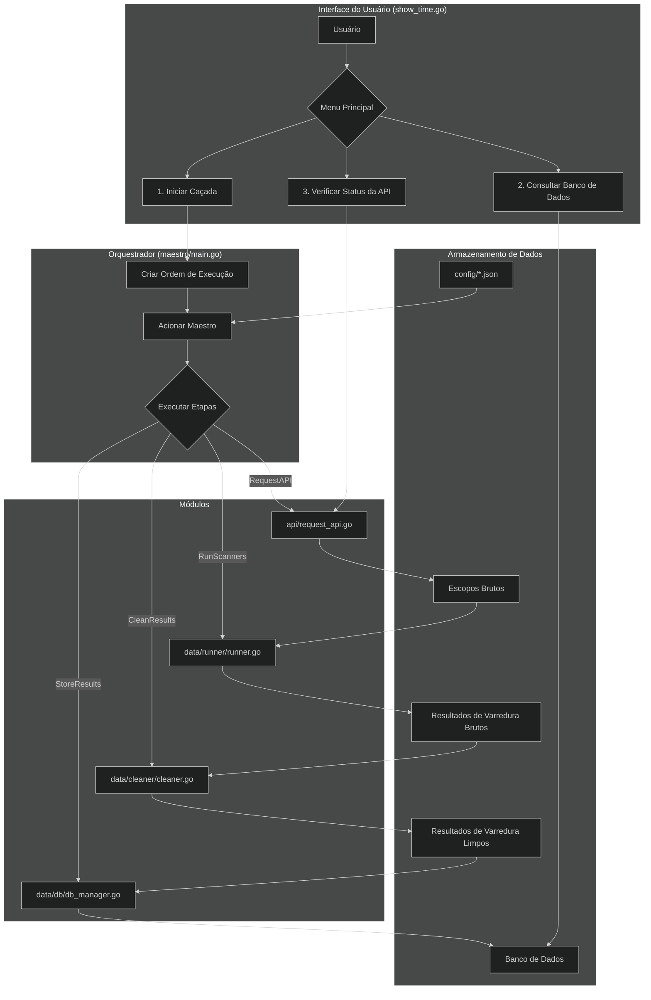

# AutoHunting

O **AutoHunting** é um framework para automação de tarefas de bug bounty e pentesting. Ele foi projetado para orquestrar um fluxo de trabalho de reconhecimento e varredura, automatizando a coleta de escopos de plataformas de bug bounty, executando ferramentas de segurança como Nmap e Ffuf, limpando os resultados e armazenando-os em um banco de dados para análise.

O projeto é controlado por uma interface de linha de comando (CLI) interativa e é altamente configurável através de arquivos JSON, permitindo que os usuários personalizem comandos, ferramentas e fluxos de trabalho.

## Arquitetura e Fluxo de Trabalho

O diagrama abaixo ilustra o fluxo de execução principal do AutoHunting, desde a interação do usuário até o armazenamento dos resultados.



## Como Funciona

O projeto é dividido em vários módulos, cada um com uma responsabilidade específica:

### 1. `cmd/show_time.go` - A Interface do Usuário

Este é o ponto de entrada principal para o usuário. Ele fornece um menu CLI interativo para:

*   **Iniciar uma Caçada:** Esta opção aciona o fluxo de trabalho principal da aplicação. Ele solicita que o usuário selecione uma plataforma (por exemplo, HackerOne) e, em seguida, cria uma "ordem de execução" para o `maestro` seguir.
*   **Consultar o Banco de Dados:** Esta opção permite que o usuário execute consultas no banco de dados, como listar os escopos de uma plataforma específica.
*   **Verificar Status da API:** Esta opção verifica o status das APIs da plataforma de bug bounty para garantir que elas estejam acessíveis.

### 2. `cmd/maestro/main.go` - O Orquestrador

O `maestro` é o coração do framework AutoHunting. Ele lê uma "ordem de execução" (um arquivo JSON) e executa uma série de etapas em uma sequência predefinida. As principais etapas são:

*   **`RequestAPI`:** Busca escopos de plataformas de bug bounty.
*   **`RunScanners`:** Executa scanners de segurança (como Nmap e Ffuf) nos escopos coletados.
*   **`CleanResults`:** Limpa e analisa a saída bruta dos scanners.
*   **`StoreResults`:** Armazena os resultados limpos no banco de dados.

O `maestro` é responsável por orquestrar todo o fluxo de trabalho, garantindo que cada etapa seja executada na ordem correta e que os dados fluam sem problemas entre os diferentes módulos.

### 3. `utils/json_loader.go` - O Gerenciador de Configuração

Este módulo utilitário é responsável por carregar e gerenciar os arquivos de configuração JSON. Ele fornece uma maneira centralizada de acessar os dados de configuração, facilitando a personalização do comportamento da aplicação.

### 4. `api/request_api.go` - O Coletor de Escopo

Este módulo é responsável por buscar escopos de plataformas de bug bounty. Atualmente, ele suporta o HackerOne e pode ser estendido para suportar outras plataformas como Bugcrowd, Intigriti e YesWeHack. Ele se autentica com a API da plataforma, busca os escopos do programa e os salva em um arquivo.

### 5. `data/runner/runner.go` - O Executor de Scanner

Este módulo é responsável por executar os scanners de segurança externos. Ele recebe uma lista de alvos e um modelo de comando e, em seguida, executa o comando para cada alvo simultaneamente. Ele foi projetado para ser flexível e pode ser usado para executar qualquer ferramenta de linha de comando.

### 6. `data/cleaner/cleaner.go` - O Analisador de Resultados

Este módulo é responsável por limpar e analisar a saída bruta dos scanners. Ele usa expressões regulares definidas em modelos JSON para extrair dados estruturados da saída não estruturada das ferramentas. Isso permite uma maneira flexível e extensível de suportar diferentes ferramentas e formatos de saída.

### 7. `data/db/db_manager.go` - O Gerenciador de Banco de Dados

Este módulo é responsável por todas as interações com o banco de dados. Ele se conecta ao banco de dados, cria as tabelas necessárias e insere os dados limpos dos scanners. Ele também fornece funções para consultar o banco de dados.

### 8. `data/results/process_results.go` - O Processador de Escopo

Este módulo é responsável por processar os escopos brutos coletados pelo módulo `api`. Ele unifica os escopos de diferentes fontes, remove duplicatas e cria uma lista limpa de alvos para o módulo `runner`.

## Detalhamento dos Módulos

### `api`

O módulo `api` é responsável por se conectar às APIs de várias plataformas de Bug Bounty para coletar e baixar os escopos dos programas. Atualmente, ele suporta a plataforma **HackerOne**, com uma estrutura preparada para a expansão futura para outras plataformas como Bugcrowd, Intigriti e YesWeHack.

### `cmd`

O diretório `cmd` contém os pontos de entrada da aplicação.

*   **`show_time`**: É a interface de linha de comando (CLI) e o ponto de entrada para o usuário do sistema AutoHunting. Ele atua como o "controlador" ou "rosto" do projeto, responsável por apresentar menus, coletar as escolhas do usuário e traduzir essas escolhas em ordens claras para o `Maestro`.
*   **`maestro`**: É o cérebro e o executor central do sistema AutoHunting. Ele é projetado para operar sem interação direta do usuário, funcionando como um serviço de backend que recebe ordens, executa tarefas complexas e registra seu progresso de forma detalhada.

### `config`

Este diretório contém as configurações essenciais para o projeto AutoHunting.

*   **`json`**: Contém os arquivos de configuração JSON que definem parâmetros para a pipeline de coleta, varredura, limpeza e armazenamento de dados de bug bounty.
*   **`db_config.sh`**: Um script Bash para instalação, configuração e gerenciamento de bancos de dados (PostgreSQL, MariaDB, MySQL, MongoDB) com integração ao Metasploit, criação de usuários, política de retenção de dados e configuração de cron jobs.

### `data`

O diretório `data` contém os módulos que lidam com o processamento de dados.

*   **`cleaner`**: O `cleaner.go` é o componente de inteligência léxica do AutoHunting. Sua principal responsabilidade é transformar os resultados brutos e não estruturados, gerados por ferramentas de varredura como Nmap e Nuclei, em dados limpos, formatados e prontos para serem inseridos no banco de dados.
*   **`db`**: O `db_manager.go` é a camada de persistência de dados do `AutoHunting`. Sua principal responsabilidade é gerenciar a conexão com o banco de dados e inserir os resultados limpos e processados, que foram gerados pelas etapas anteriores do pipeline.
*   **`results`**: O `process_results.go` atua como o módulo centralizador e validador dos dados de escopo coletados. Sua principal responsabilidade é unificar os alvos provenientes de diferentes fontes, como as APIs de plataformas de Bug Bounty (`Request_API.go`) e, futuramente, os resultados interpretados por IA (`AI_scope_interpreter.go`).
*   **`runner`**: O `runner` é o "motor" ou os "braços" do sistema AutoHunting. Sua única e crucial responsabilidade é executar ferramentas de segurança externas (como Nmap, Ffuf, etc.) de forma controlada e concorrente.

### `utils`

O pacote `utils` agrupa funções auxiliares e genéricas que são utilizadas por múltiplos módulos ao longo do projeto `AutoHunting`. O arquivo `json_loader.go` é um componente central deste pacote, fornecendo uma maneira padronizada e robusta de carregar e decodificar arquivos de configuração no formato JSON.

## Arquivos de Configuração

O comportamento do AutoHunting é controlado por um conjunto de arquivos JSON no diretório `config/json`:

*   **`env.json`:** Contém as principais configurações de ambiente, como caminhos de arquivo para logs, resultados e outros dados.

```txt 
/
└── etc
    └── AutoHunting
        ├── api_result_clean/
        ├── api_result_dirt/
        ├── Clean/
        ├── Dirt/
        ├── json/
        ├── maestro/
        │   └── escopos/
        ├── maestro_status.json
        └── order.json
```

```txt
  tmp/
    └── AutoHunting/
                └── log/
```

```txt
/usr
  └── share/
        └── wordlist/
              └── SecList(exemple)/
```


*   **`commands.json`:** Define os modelos de linha de comando para os scanners de segurança. Isso permite que você personalize facilmente os comandos que são executados pelo `runner`.
*   **`tokens.json`:** Armazena os tokens de API para as plataformas de bug bounty.
*   **`order-templates.json`:** Contém modelos para as ordens de execução que o `maestro` segue. Isso permite que você defina diferentes fluxos de trabalho para diferentes tarefas.
*   **`cleaner-templates.json`:** Define os modelos para o módulo `cleaner`, incluindo as expressões regulares e os campos a serem extraídos para cada ferramenta.
*   **`db_info.json`:** Contém os detalhes de conexão para o banco de dados.

## Configuração do Banco de Dados

O script `db_config.sh` é usado para instalar, configurar e gerenciar os bancos de dados suportados. Ele oferece um menu interativo para facilitar a administração de sistemas de bancos de dados em ambientes Linux.

## Começando

1.  **Instale as Dependências:** Execute o script `install.sh` para instalar as ferramentas e dependências necessárias.
2.  **Configure o Ambiente:** Execute os scripts `config_enviroment.sh` e `db_config.sh` para configurar os caminhos dos arquivos e a conexão com o banco de dados.
3.  **Adicione Tokens de API:** Preencha seus tokens de API no arquivo `config/json/tokens.json`.
4.  **Execute a Aplicação:** Execute o binário `show_time` para iniciar a CLI interativa.

```bash
go run cmd/show_time.go
```

## Melhorias Futuras

*   **Paralelismo:** Várias partes do código, como as etapas `RequestAPI` e `CleanResults`, podem ser paralelizadas para melhorar o desempenho.
*   **Abstração de SQL:** As consultas SQL no `db_manager` podem ser abstraídas para suportar diferentes sistemas de banco de dados.
*   **Interpretação de Escopo Baseada em IA:** Um módulo de IA pode ser adicionado para interpretar o escopo de um programa a partir de descrições em linguagem natural.
*   **Painel Web:** Um painel baseado na web pode ser criado para visualizar os resultados e gerenciar a aplicação.

